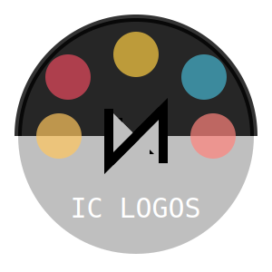

#  Iconicly Created 

    An app intended to take user input to generate a small logo, the user will choose up to 3 letters, a color, and a shape.

## License

This application is covered under the MIT license.

## Table of Contents

- [Installation](#installation)
- [Usage](#usage)
- [Contributing](#contributing)
- [Tests](#tests)
- [Questions](#questions)
- [Links](#links)
- [Walkthrough-Video](#walkthrough-video)

## Installation

    To install the necessary dependencies, run the following command:
        npm install

## Usage

To use the app, run the following command:

    node index.js

## Contributing

    Contributions are welcome. Please submit a pull request if you would like to contribute to this project.

## Tests

    To run tests, run the following command:
     npm test

## Questions

    If you have any questions, please contact me at trentonponder2001@gmail.com.

## Links

    Here you can find the repository and download the software https://github.com/Kviponder/Iconicly-Created

    You can find more of my work at [Kviponder](https://github/com/Kviponder).

## Walkthrough-Video

    Here you can watch a walkthrough video of the application https://drive.google.com/file/d/1JTtQxWJiBme7zgLSGpGO0e_SDoeyX37p/view?usp=sharing

## Code Sources
    I worked with two other students, Will F. and James M. in order to add switch functions to the code. I also used the following sources to help me with the code: my TA's and an old README project.

### Notes
    For my personal addage, I've generated an icon for the app itself, as seen above.  I used chapGPT, it is not what i intend to be graded on it was just for fun extending what i had learned.  I created the circles myself, then researched how to use a feature of css within my icon, then based on that I decided an animation would be fun.  I used chatGPT to help me configure the rotation for the circles, then using that, I had gpt generate a small unique icon using paths.  I then added the animation to the new paths.  I just wanted to clarify that this is not what I intend to be graded on, it was just for fun.  I hope you enjoy it!  